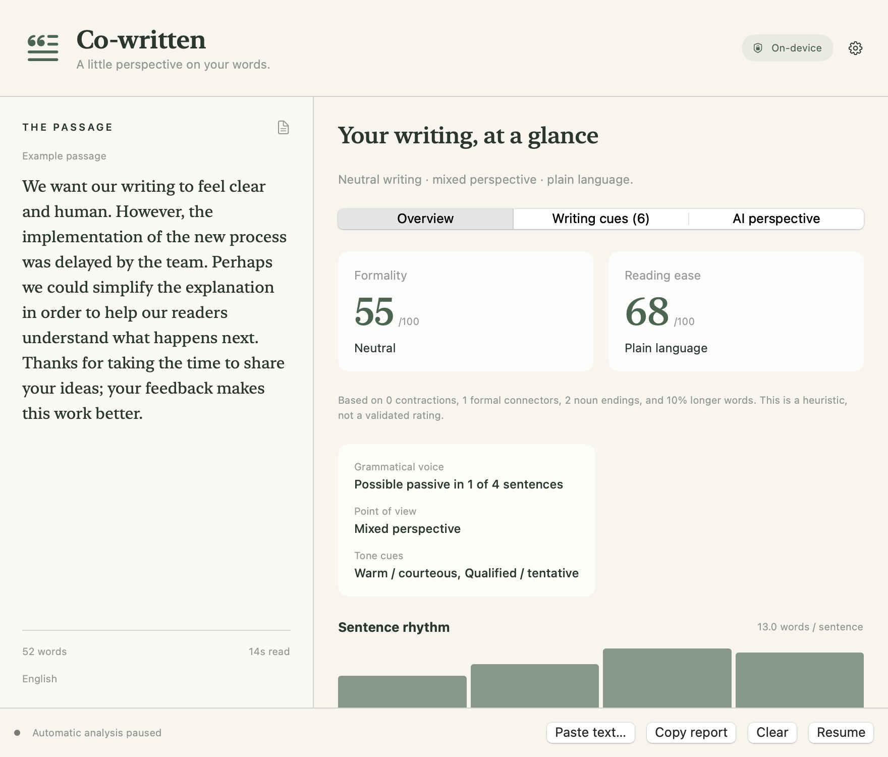

# Co-written

A quiet macOS menu-bar companion that helps you understand your writing. Select a passage, press **⇧⌘L**, and explore its voice, formality, readability, and rhythm. The app is self-sufficient: local analysis runs on your Mac, and optional AI connects directly to OpenAI.

**[Download the latest DMG](https://github.com/acousland/co-written/releases/latest)** · macOS 14+ · Apple Silicon and Intel



## What it looks for

| Lens | What you see |
| --- | --- |
| Grammatical voice | Possible passive constructions, with their exact wording |
| Point of view | First, second, third, or mixed personal pronouns |
| Register | An explainable formality estimate and its supporting cues |
| Reading ease | Approximate English Flesch score and average sentence length |
| Tone | Courteous, tentative, directive, questioning, or emphatic cues |
| Rhythm | A bar for each sentence, highlighting longer sentences |
| Precision | Hedging, intensifiers, wordy phrases, and abstract noun endings |
| Vocabulary | Frequently repeated content words and unique-word percentage |
| Optional AI | Contextual strengths and suggestions, connecting directly to OpenAI with your own key |

These are cues to consider, not errors to fix. Formal writing is not inherently better, passive voice is often useful, and dialect and genre matter. Local style rules support English; other languages receive basic statistics. Scores are heuristic estimates, with no claims of validated accuracy. Selections are limited to the first 20,000 characters.

## Use it

1. Drag the app from the DMG into Applications and open it.
2. Use the quotation-mark menu-bar icon to open Settings. Grant Accessibility for selection reading.
3. Select text in another app. Automatic local analysis waits for a stable selection; **⇧⌘L** opens the results. The panel can open automatically if you enable that setting.
4. Click a writing-cue card to highlight its evidence. Copy the report if helpful.

You can pause automatic analysis, exclude apps by bundle identifier, and start the app at login. Secure fields and default password-manager exclusions are skipped. Some apps do not expose selected text; use **Services → Analyse with Co-written** or **Paste text** in the panel. No simulated Copy operation or keystroke recording is used.

## Privacy and optional AI

Local analysis keeps the current passage in memory, collects no telemetry, and saves no writing history. Clear discards the passage. Automatic analysis clears it when you deselect in another app. Opening the panel retains the passage so you can inspect it. The app makes network requests for update checks; writing is sent only when you explicitly choose AI analysis and confirm the destination.

The app connects **directly to OpenAI** when you choose AI analysis. Add your own API key in Settings; it is kept in macOS Keychain on this Mac, sent only to `api.openai.com`, and never written to app preferences, writing reports, source, or release artifacts. Each AI request asks before sharing the current passage. API use is billed to the key's OpenAI account. No separate server, account signup, or Docker installation is needed. The app uses the pinned `gpt-4.1-mini-2025-04-14` model with strict Structured Outputs and a 2,000-token output limit. It validates quoted evidence before displaying advice.

**No shared OpenAI key is bundled.** A key embedded in any downloadable app can be extracted, including from a signed or encrypted bundle. Your key remains private on your own Mac; other people who download Co-written supply their own keys. This matches [OpenAI's key-security guidance](https://developers.openai.com/api/reference/overview).

For an owner who wants to pay for other users' AI access, an optional [protected backend](server/README.md) is included in the same repository. This is an alternative connection mode, not a dependency of the app. It issues individual revocable tokens and enforces persistent per-user and global quotas; the provider key stays on that server. It is not deployed or preconfigured in this release.

Both AI modes use OpenAI Responses with `store: false`; this does **not** remove all provider retention. Consult [OpenAI's data controls](https://developers.openai.com/api/docs/guides/your-data). Local analysis needs no API key or network connection. Live AI requests require a valid user-supplied key and have not been exercised with a real key in this initial build.

## Build and release

```sh
swift test
PYTHONPATH=server python3 -m unittest discover -s server/tests
scripts/build-app.sh
```

Open `dist/Co-written.app`. The universal build uses Swift Package Manager, AppKit, SwiftUI, Apple's NaturalLanguage framework, and pinned Sparkle 2.10.0. Open `Package.swift` in Xcode if preferred. A developer build can be ad hoc signed; a public release requires the owner's Developer ID certificate, notarisation credentials, and Sparkle private signing key in Keychain.

```sh
# Local UI snapshots and packaging checks
dist/Co-written.app/Contents/MacOS/CoWrittenMac --ui-check dist/ui
# Build, notarise, package and prepare the signed feed without publishing
scripts/prepare-release.sh
# Publish the committed and pushed VERSION, then update appcast.xml in this same repo
scripts/publish-release.sh
```

See [release operations](docs/Releasing.md). Source, backend, appcast, and binary releases share this single public repository. No signing or provider secrets belong here.

## Contributing

Changes to linguistic rules should include contrasting examples and retain uncertainty language. Keep text processing bounded and local by default. Security reports: use GitHub's private vulnerability reporting if enabled, rather than posting keys or user writing in an issue.

MIT licence. Sparkle remains under its own licence included in the framework.
